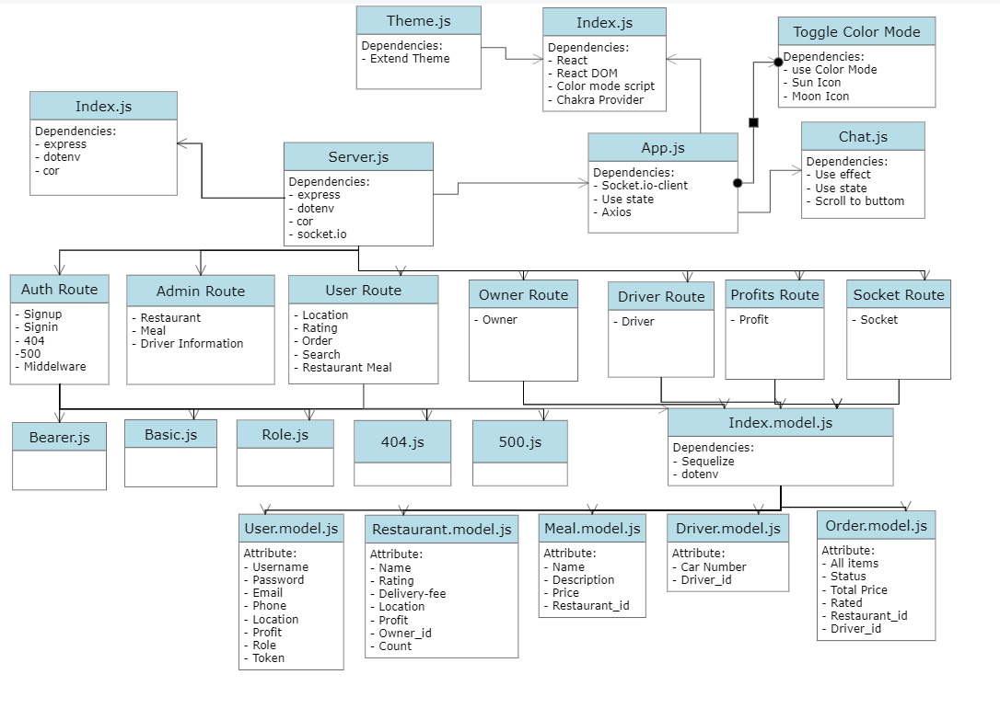
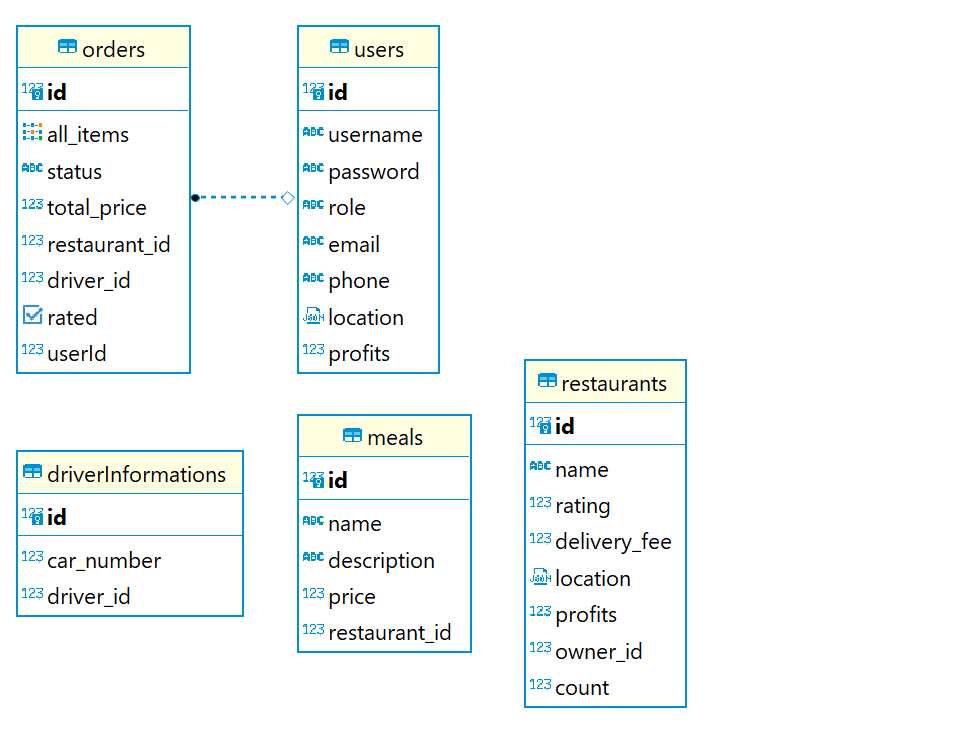
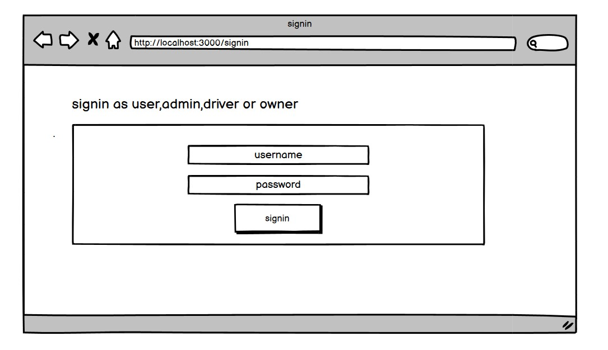
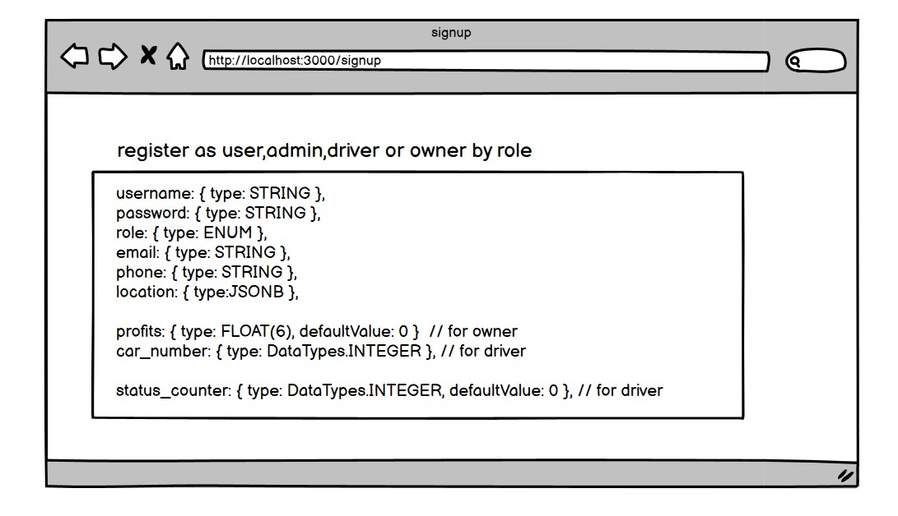
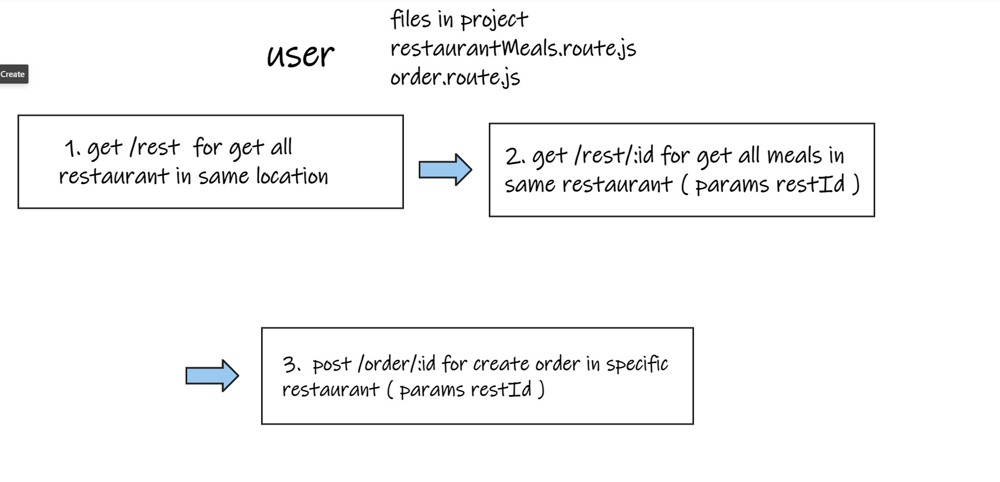
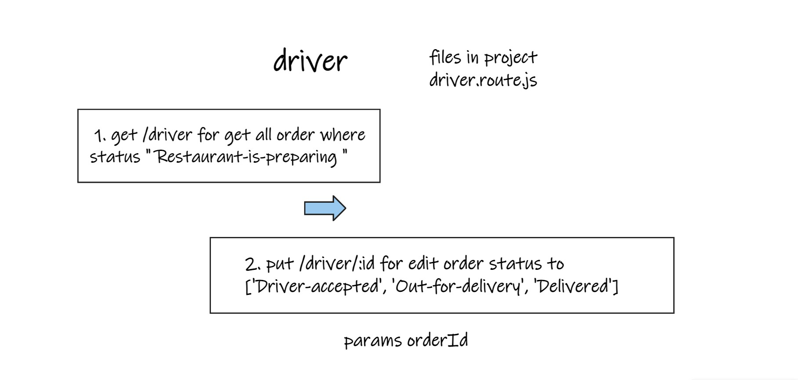

# Mr.Delivery

## Group-4, Mid-Project

[GITHUB](https://github.com/WISTA02/better-talabat-clone)

[HEROKU]()

 

## ✨Team members✨

1. Ibraheem Hammodeh - Team Leader

2. Samah Al-Satary

3. Tasneem Maqableh

4. Wajeeh Hussien

5. Anas Abo-Obeed

 

## Configuration
Configure the root of your repository with the following files and directories. Thoughfully name and organize any aditional configuration or module files.

* README.md - contains documentation

* .env - contains env variables (should be git ignored)

* .gitignore - contains a .gitignore file

* package.json - contains npm package config

* index.js - the entry point for your application

* src/ - contains your core application files and folders

* client - contains files and folders for chat-application

* __test__/ - contains unit tests

* package.json - contains npm package config

  - create a test script for running tests
  - create a start script for running your server

 

## Authrization

1. Admin - Controlling Every Route .

2. Users - POST Order/ Rating.

3. Drivers - Change The Status Of Order (Driver-accepted, Out-for-delivery, Delivered).

4. Owner - Change The Status Of Order (Restaurant-is-preparing).

##  Dependencies
* base-64

* bcrypt

* cors

* dotenv

* express

* jsonwebtoken

* morgan

* nodemon

* pg

* sequelize

* sequelize-cli

* sqlite3

* socket.io

* socket.io-client 

* supertest

* jest

* axios

* react

* react-dom

* react-fetch-hook

* react-scripts

* react-scroll-to-bottom

* react-superagent

* socket.io-client

* superagent

* web-vitals

## Auth Routes

|    **method**        |   **link**      |  **Description** |
| -----------          | -----------     | ------------     |
|    POST              |  /signup   |    Signup    |
|    POST              |  /signin   |  	 Signin    |
|    PUT               |   /updateAccount   |  Delete user recored|
|   DELETE             |  /deleteAccount    |  Update user recored|
|    GET               |   /users    |  Get all users for admin|
|    GET               |   /secret   |  Get The token and description for users|

 

## Admin-Routes

## // Restaurant>> 

|    **method**        |   **link**      |  **Description** |
| -----------          | -----------     | ------------     |
|    GET      |  /restaurant  |    Get All Restaurant   |
|    GET      |  /restaurant/:id  |    Get Specific Restaurant   |
|    POST      |  /restaurant  |    Create Restaurant    |
|    PUT      |  /restaurant/:id  |  	 Update Restaurant    |
|   DELETE     |  /restaurant/:id    |  Delete Restaurant|

 

## // Meal>>

|    **method**        |   **link**      |  **Description** |
| -----------          | -----------     | ------------     |
|    GET     |  /meal      |    Get All Meal    |
|    GET     |  /meal/:id  |  Get Specific Meal |
|    POST    |  /meal      |    Create Meal     |
|    PUT     |  /meal/:id  |  	 Update Meal    |
|   DELETE   |  /meal/:id  |  Delete Meal       |

 

## // driver Information>>

|    **method**        |   **link**      |  **Description** |
| -----------          | -----------     | ------------     |
|    GET     |  /driverinfo      |    Get All Driverinfo      |
|    GET     |  /driverinfo/:id  |  Get Specific Driverinfo   |
|    POST    |  /driverinfo      |    Create Driverinfo       |
|    PUT     |  /driverinfo/:id  |     Update Driverinfo      |
|   DELETE   |  /driverinfo/:id  |     Delete Driverinfo      |

 

## Driver-Routes
|    **method**        |   **link**      |  **Description** |
| -----------          | -----------     | ------------     |
|    GET       |  /driver             |       Get All Driverinfo      |
|    PUT       |  /driver/:id        |         Update Status          |
|    GET       |  /driver-history     |      Get Driver History       |

 

## Owner-Routes
|    **method**        |   **link**      |  **Description** |
| -----------          | -----------     | ------------     |
|    GET       |      /order/owner            |       Get All Owner          |
|    PUT       |     /order/owner/:id         |       Update Owner           |
|    GET       |      /owner-history          |     Get Owner History        |

 

## User-Routes

## // Location-Route>>

|    **method**        |   **link**      |  **Description** |
| -----------          | -----------     | ------------     |
|    PUT       |     /location        |       Update Location          |

 

## // Order-Route>>

|    **method**        |   **link**      |  **Description** |
| -----------          | -----------     | ------------     |
|    GET       |     /order        |      Get All Order        |
|    GET       |   /order/:id      |    Get Specific Order     |
|    POST      |    /order         |      Create Order         |
|    PUT       |   /order/:id      |  	  Update Order         |
|   DELETE     |   /order/:id      |      Delete Order         |
 

  

## // Rating-Route>>

|    **method**        |   **link**      |  **Description** |
| -----------          | -----------     | ------------     |
|    GET       |     /rating        |      Get User Order        |
|    PUT       |   /rating/:id      |    Update Rating           |

 

## // RestaurantMeals-Route>>

|    **method**        |   **link**      |  **Description** |
| -----------          | -----------     | ------------     |
|    GET       |     /rest             |      Get All Restaurant In The Same Location        |
|    GET       |   /rest-meal/:id      |    Get All Meals     |

 

## // Search-Route>>

|    **method**        |   **link**      |  **Description** |
| -----------          | -----------     | ------------     |
|    GET       |     /search         |      Search Restaurant    |
|    GET       |   /search-meal      |      Search Meal          |

 

## Profits-Route

|    **method**        |   **link**      |  **Description** |
| -----------          | -----------     | ------------     |
|    GET       |     /profits-owner        |      Get Profit Owner   |
|    GET       |     /profits-app        |      Get Profit App       |
|    GET       |     /profits-driver     |      Get Profit Driver    |

 

## Socket-Route

|    **method**        |   **link**      |  **Description** |
| -----------          | -----------     | ------------     |
|    GET       |     /getUser      |      Get All User     |

 

## UML

 

## ER Diagram
 

 

## Wireframe

 

 

 

## Installation
- Mr.Delivery requires Node.js v14+ to run.

- Install the dependencies and devDependencies and start the server.

1. cd Mr.Delivery

2. npm i

3. npm start

 

- For production environments...

1. npm install --production

2. NODE_ENV=production node index

 

## License

MIT

